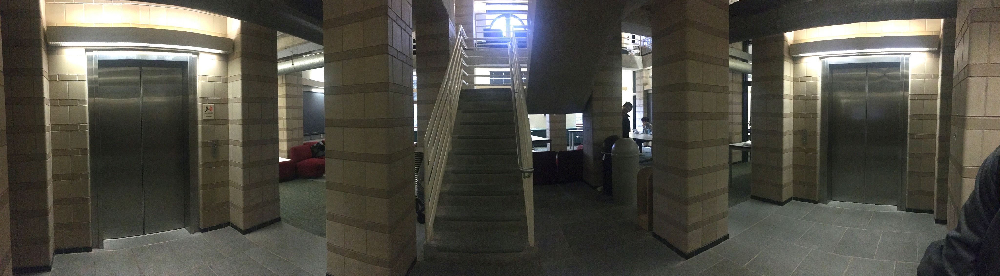
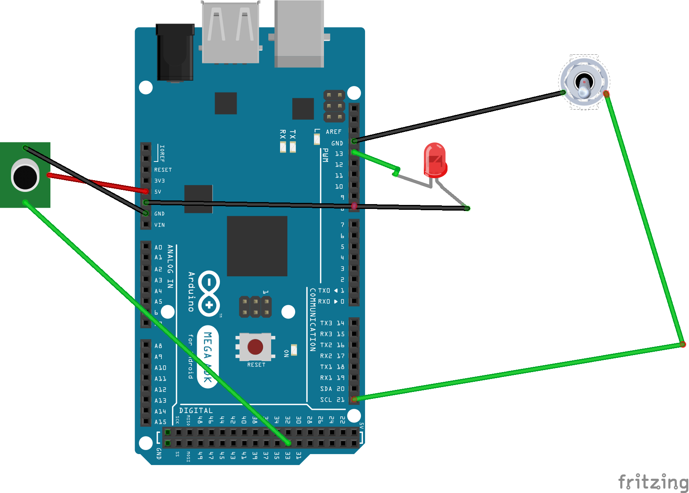

## Distributed Networks: Task 1 Documentation

## Members

Bryce Bjork,
Felicia Chang,
Justin Cong,
Yuki de Pourbaix,
Varsha Raghavan

## Input Sensors and Devices

5 ESP32s,
4 Motion Sensors,
3 Ultrasonics,
1 IR Sensor,
1 Microphone,
1 Switch,
1 LED

## Input Network Setup

Our installation is built around the staircase located between floors 2 and 3 in AKW. Two ESP32s with a combination of ultrasonic, motion, and IR sensors will be mounted on the side of the staircase, and each sensor will be associated with a specific step (six steps in total). Two ESP32s with one ultrasonic sensor each will be mounted at the top of the elevator entryways in floor 2. Finally the last ESP32 attached to a microphone, switch, and LED will be mounted on the wall near the staircase.

The intent with these input locations is to capture the general activity that takes place on AKW floor 2. Specifically, the elevator sensors will capture how often each elevator is used, the stair sensors will capture whether that specific stair has been stepped on or not, and the microphone wall mount will provide the user with an option to flip a switch and record the surrounding noise level/ speak into it.  

## Data Network Setup

In order to communicate all input values from the sensors in a centralized way, we have implemented a mesh network via Painless Mesh. Painless Mesh is a wifi-enabled mesh network. Each ESP32 is associated with a specific node, and all nodes are hosted on the same port (5555). When sensor values are received, a message is sent through this port that communicates the specific input value and the node it originated from. A Raspberry Pi, connected through Painless Mesh Listener, will be listening on the same port for these messages, and as it receives them it will determine the appropriate output.
We rely on painlessMesh and painlessMeshBoost.
An example of the painlessMeshBoost in action on the raspberry pi can be found using the sim_osc.py in conjunction with the .pde file found in exhibit.
Please note that all valid messages must be 6 characters long.
In the case of the microphone, this means that some values require padding, i.e., 0 -> 000000

## Microphone Documentation - Justin

Creating the microphone box to get input is pretty straightforward, not even requiring a breadboard! This will gather audio levels of the area around the microphone, and send them to other ESP32s on the mesh network. If the box is switched off, audio levels will not be recorded, and the LED will be switched off. Flip the switch to turn on the LED, and the microphone will begin capturing and sending audio levels. 

### Hardware Requirements
- Project box
- Espressif ESP32 DevKitC
- SPST Switch (sodered)
- Red LED (sodered)
- Various jumper cables
- Microphone
- Micro USB cable
- Power block and/or USB battery pack.

### Hooking it Up

Time to hook up the cables! Above is an example of the wiring hookup, although my box uses an ESP32, not an Arduino. 

#### SPST Switch
- Connect one end to the GND on the ESP32.
- Connect the other end to the pin 21 on the ESP32.

#### LED
- Connect one end to the GND on the ESP32.
- Connect the other end to pin 13 on the ESP32.

#### Microphone
- Connect the VCC to the 5V out on the ESP32.
- Connect the GND to the GND out on the ESP32.
- Connect the OUT to pin 33 on the ESP32.

Place all of these in the project box, drilling holes for the LED, microphone, switch, and micro USB cable. Hook up the micro USB cable to the ESP32 and connect it to power via a power block or a battery pack, and you'll be ready to go!

### Software to Install
- You'll need to install the Arduino IDE in order to flash the ESP32 with the mic.ino file!
